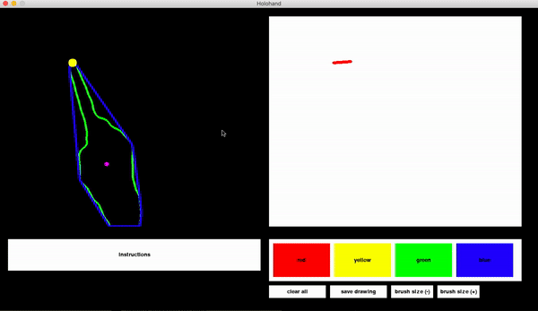

Motivation
----------
- Became interested in OpenCV and wanted to work on a creative project to develop my knowledge

Current Progress
----------------

1) The user's hand gets tracked when they are wearing a high visibility glove (i experimented with other methods like training a haar cascade to recognise hands but to no avail.)
2) When the user has a single finger extended, they are able to paint using their selected colour
3) The user is able to save their drawings

Things to do
------------
1) Using the MNIST database, I could incorporate some extra feature to recognise the user's hand drawn digits
2) Add speech recognition functionality to allow the user to command the program using their voice 

Extra
-----

Video demonstration : https://www.youtube.com/watch?v=52szzMjU4HU

For the development journey and code walkthrough, click the image below...

The HaarCascade folder contains two pretrained haar cascades able to detect eyes and faces in an image. The python program in the same folder is a simple program that accesses your webcam, displays a live feed and draws squares around the eyes and faces detected in the frame 

The hsv_trackbar python program is the one mentioned at the start of the development journey article. It simply displays trackbars and shows how changing hsv values affects the live feed from the webcam

The finger_painting program is the *main* program

